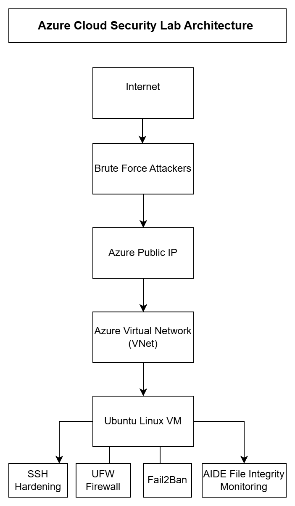
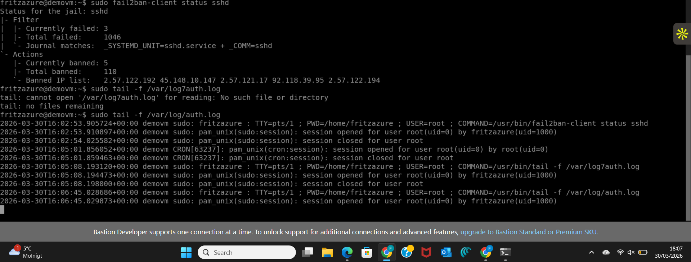
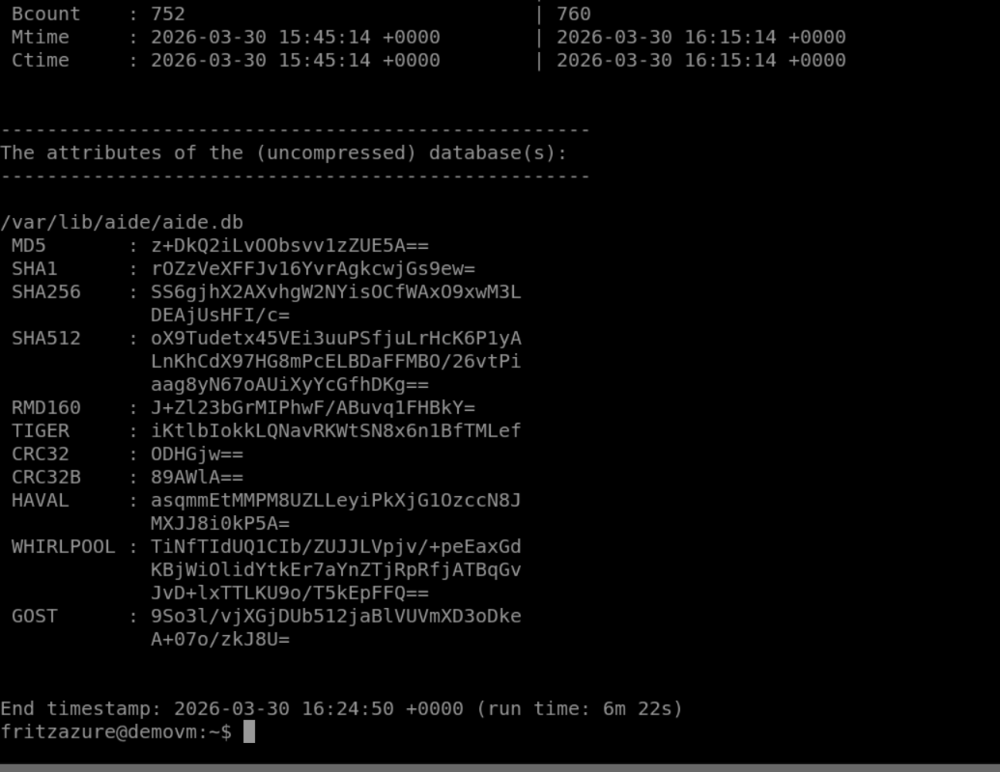

# Azure Cloud Security Lab
Hands-on cloud security lab demonstrating Linux VM hardening and monitoring techniques in Microsoft Azure, including SSH protection, firewall configuration, brute-force attack and file integrity monitoring. 

## Overview
This project demonstrates how to secure a Linux virtual machine deployed in Microsoft Azure.
## Architecture Diagram

The lab simulates real-world cloud security practices including SSH hardening, firewall configuration, brute force protection, and file integrity monitoring.

## Technologies Used
- Microsoft Azure
- Ubuntu Linux
- SSH
- UFW Firewall
- Fail2Ban
- AIDE (Advanced Intrusion Detection Environment)

## Security Implementations

### SSH Hardening
Modified SSH configuration to improve system security.

### Firewall Configuration
Configured UFW firewall to allow only necessary services.

### Fail2Ban
Installed Fail2Ban to automatically block IP addresses attempting brute force attacks.

### AIDE File Integrity Monitoring
Implemented AIDE to detect unauthorized changes to system files.

### Log Analysis
Used system logs to identify brute force attacks:
## Security Monitoring
### SSH Authentication Logs
Authentication logs were monitored to observe login attempts and administrative activity on the Linux VM
Command used:

sudo tail -f /var/log/auth.log

Example output:

### File Integrity Monitoring (AIDE)

AIDE was installed to detect unauthorized changes to system files.

Initialization command:

sudo aideinit

Integrity check command:

sudo aide --config /etc/aide/aide.conf --check

Example output:

